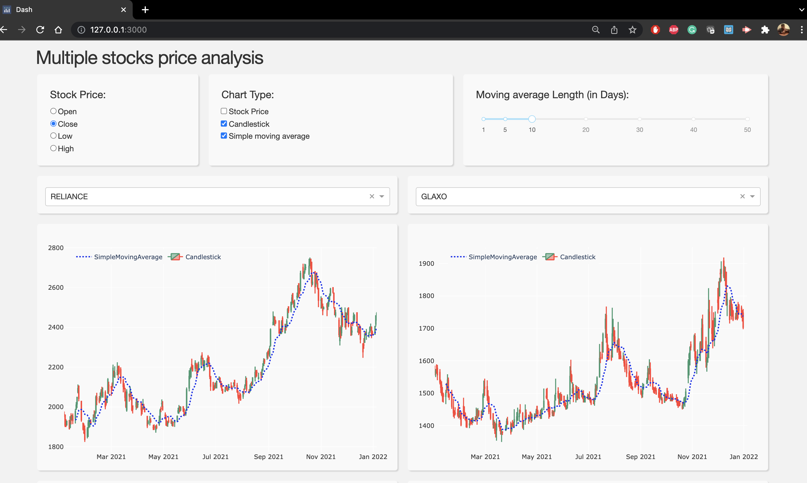

## Introduction
`finance_dashboard` is a sample plotly interactive dashboard to track the last *1 year* price movement for the stocks along with facilities to generate the [**simple moving average**](https://www.investopedia.com/terms/s/sma.asp)  and [**candlestick patterns**](https://www.investopedia.com/trading/candlestick-charting-what-is-it/) graphs. 

The dashboard can be used to track **six** companies stock prices at a time. It makes use of [**yfinance**](https://pypi.org/project/yfinance/) package to get stock info from [Yahoo finance website](https://finance.yahoo.com/).  Note, the sample symbols are for companies listed on [NSE (National Stock Exchange)](https://www.nseindia.com/).

## Screenshots


## Screencast


## Downloading and running the app

Either clone the repository or visit the [Github page](https://github.com/garg-aayush/finance_dashboard_example) and download and `unzip` the folder. 

```
git clone garg-aayush/finance_dashboard_example.git
```

Then `cd` into the app directory and install its dependencies in a conda environment in the following way:

```
conda create -n 'finance_dashboard' python=3.6 pip
conda activate finance_dashboard
pip install -r requirements.txt
```

then run the app:
```bash
python app.py
```

and open the app in a web browser by pasting the address:
```bash
http://127.0.0.1:3000/ 
```

## Feedback
To give feedback or ask a question or env setup issues you can use the [Github Discussions](https://github.com/garg-aayush/finance_dashboard_example/discussions).
