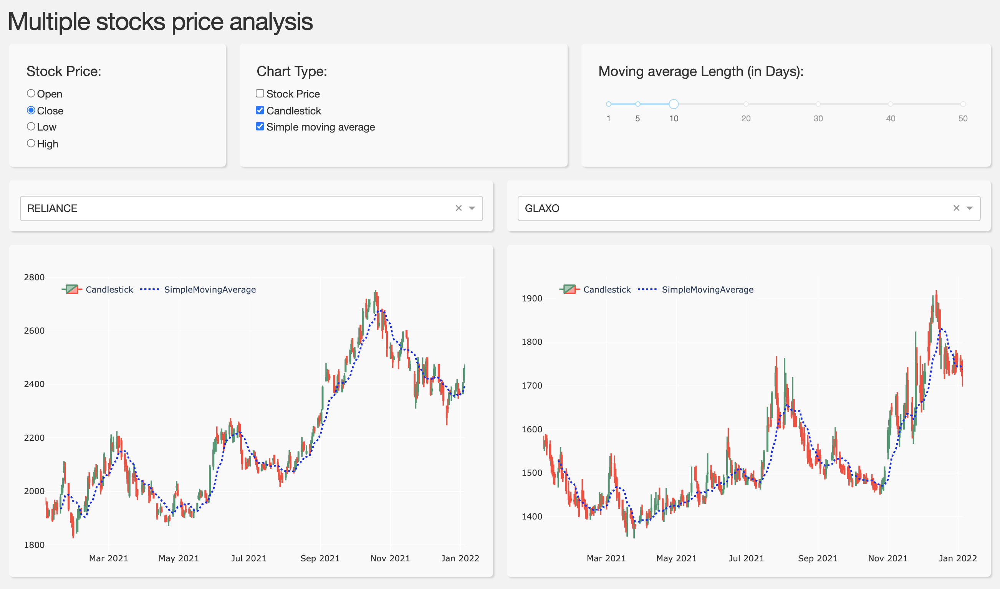

## Introduction

## Screenshots


## Screencast

## Downloading and running the app

Either clone the repository or visit the [Github page](https://github.com/garg-aayush/finance_dashboard_example) and download and `unzip` the folder. 

```
git clone garg-aayush/finance_dashboard_example.git
```

Then `cd` into the app directory and install its dependencies in a conda environment in the following way:

```
conda create -n 'finance_dashboard' python=3.6 pip
conda activate finance_dashboard
pip install -r requirements.txt
```

then run the app:
```bash
python app.py
```

and open the app in a web browser by pasting the address:
```bash
http://127.0.0.1:3000/ 
```

## Feedback
To give feedback or ask a question or env setup issues you can use the [Github Discussions](https://github.com/garg-aayush/finance_dashboard_example/discussions).
